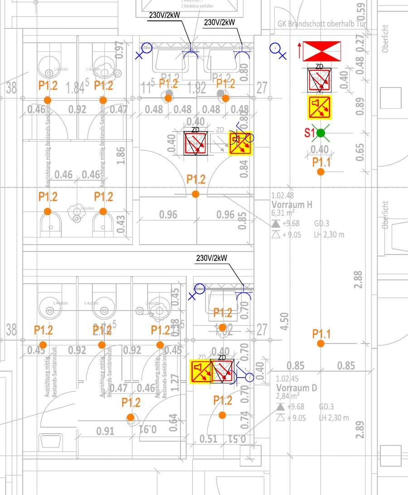
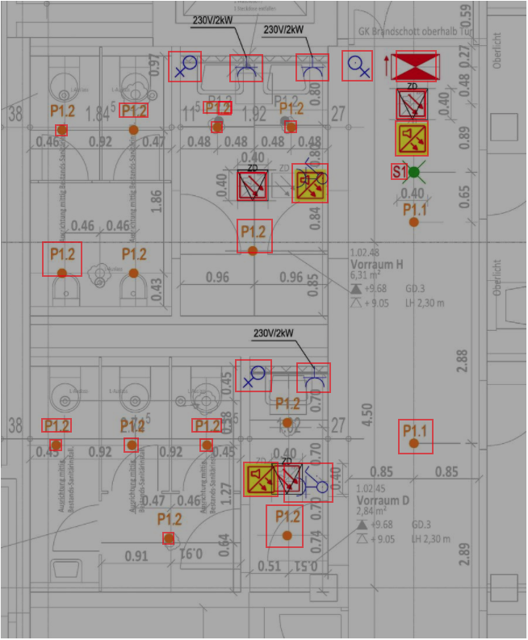

# DigiTecten

Unser Projekt zum SDaCathon 2021 (Visuelle Challenge)

## Idee

Wir wollen Symbole auf Bauplänen zu erkennen und verschiedene Funktionen wie suchen nach / zählen von Piktogrammen erlauben.

## Konzept

Unsere Erkennung läuft in mehreren Schritten. Zunächst werden interessanter Bereiche identifiziert:

1. Der Nutzer lädt eine PDF Datei mit einem Bauplan in eine Webanwendung ([webtool_backend](https://github.com/DigiTecten/webtool_backend), [webtool](https://github.com/DigiTecten/webtool))
2. Die PDF Datei wird in eine große Grafik (PNG) und in eine SVG Vektorgrafik konvertiert (Tools vorhanden 🛍) ([pdf2svg](https://cityinthesky.co.uk/opensource/pdf2svg/), [pdf2image](https://pypi.org/project/pdf2image/))
3. Die PNG Datei wird in kleien überlappende Segmente zerlegt jeweils und an ein zuvor Trainiertes CustomVisionAI Modell gesendet ([Testcode zum Trainieren unseres Modells](https://github.com/DigiTecten/custom-vision-tests))
   
4. Der Nutzer bekommt eine grobe Erkennung der interessanten Elemente in der PDF Datei angezeigt (sieht schon ganz gut aus 🚀)
   
5. Die gefunden Bereiche werden großflächig im SVG "ausgeschnitten" und für den nächsten Schritt "zurückgelegt" (Haben wir noch nicht 😕)

Die interessanten Bereiche sollen nun noch genauer klassifiziert werden. In unseren Tests hatten wir keine guten Ergebnisse mit Machinelearning für die Detailklassifikation. Die Elemente sind sich teilweise zu ähnlich.
Da wir nun den Suchbereich stark eingeschränkt haben, haben wir die Möglichkeit die vorhanden Vektorgrafiken zu vergleichen: [Idee (svg-diff)](https://github.com/DigiTecten/svg-diff)

Die Eingabe des svg-diff Algorithmus werden vom Nutzer in der Legende ausgewählt und vom neuronalen Netz vorgegeben (interessante Bereiche).
